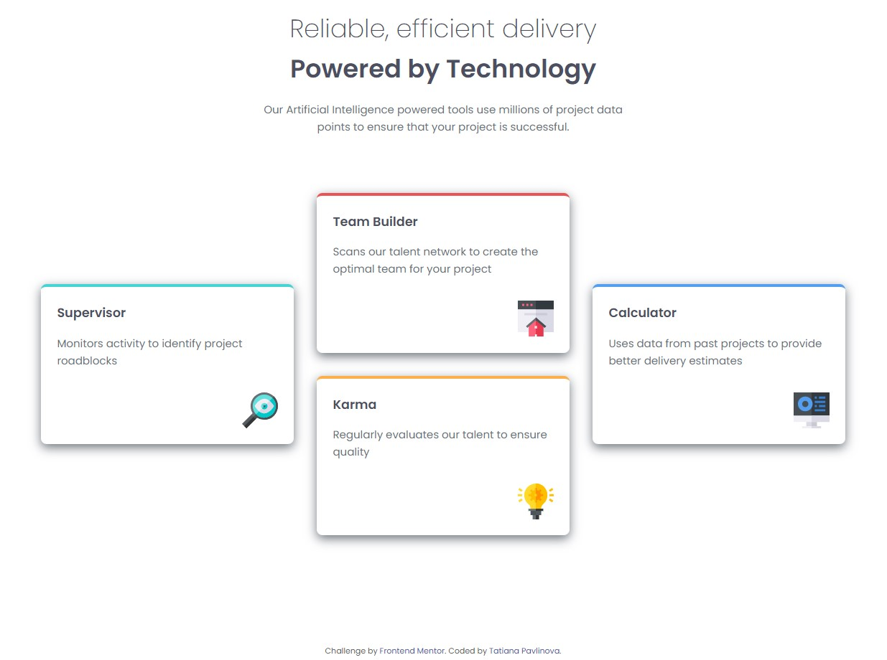

# Frontend Mentor - Four card feature section solution

This is a solution to the [Four card feature section challenge on Frontend Mentor](https://www.frontendmentor.io/challenges/four-card-feature-section-weK1eFYK). Frontend Mentor challenges help you improve your coding skills by building realistic projects. 

## Table of contents

- [Frontend Mentor - Four card feature section solution](#frontend-mentor---four-card-feature-section-solution)
  - [Table of contents](#table-of-contents)
  - [Overview](#overview)
    - [Screenshot](#screenshot)
    - [Links](#links)
  - [Author](#author)

## Overview

### Screenshot

### Links

- Solution URL: [GitHub](https://your-solution-url.com)
- Live Site URL: [Vercel](https://your-live-site-url.com)

## Author

- Frontend Mentor - [@Pavlinova](https://www.frontendmentor.io/profile/Pavlinova)

