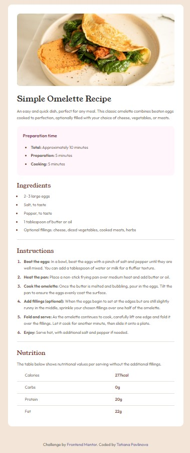

# Frontend Mentor - Recipe page solution

This is a solution to the [Recipe page challenge on Frontend Mentor](https://www.frontendmentor.io/challenges/recipe-page-KiTsR8QQKm). Frontend Mentor challenges help you improve your coding skills by building realistic projects. 

## Table of contents

- [Frontend Mentor - Recipe page solution](#frontend-mentor---recipe-page-solution)
  - [Table of contents](#table-of-contents)
  - [Overview](#overview)
    - [Screenshot](#screenshot)
    - [Links](#links)
  - [Author](#author)

## Overview

### Screenshot

### Links

- Solution URL: [GitHub](https://github.com/Pavlinova/frontend_mentor/tree/main/recipe-page)
- Live Site URL: [Vercel](https://frontend-mentor-ko6i.vercel.app/)

## Author

- Frontend Mentor - [@Pavlinova](https://www.frontendmentor.io/profile/Pavlinova)