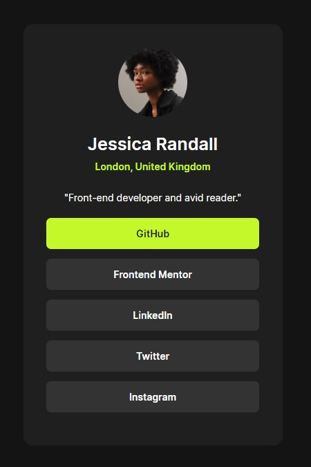

# Frontend Mentor - Social links profile solution

This is a solution to the [Social links profile challenge on Frontend Mentor](https://www.frontendmentor.io/challenges/social-links-profile-UG32l9m6dQ).

## Table of contents

- [Frontend Mentor - Social links profile solution](#frontend-mentor---social-links-profile-solution)
  - [Table of contents](#table-of-contents)
  - [Overview](#overview)
    - [Screenshot](#screenshot)
    - [Links](#links)
  - [Author](#author)

## Overview

### Screenshot

### Links

- Solution URL: [GitHub](https://github.com/Pavlinova/social-links-profile)
- Live Site URL: 

## Author

- Frontend Mentor - [@Pavlinova](https://www.frontendmentor.io/profile/Pavlinova)

